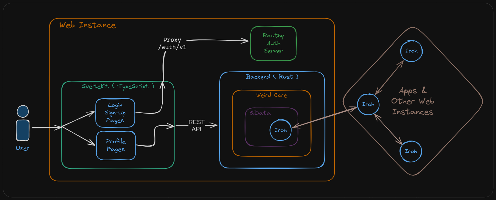

# Architecture

This describes the current architecture in Weird. Many of the pieces are experimental and may change
before we get to updating this document. Always feel free to join chat or open a discussion if you
have questions!

## Overview

The overall architecture is pictured below:

## Web Instance

The web application that we run at [Weird.One](https://weird.one) is an example of a Weird "Web Instance".

It encompasses everything that is needed to run an instance of a Weird web server.

### SvelteKit

The web application front-end is implemented with [SvelteKit](https://kit.svelte.dev).

Front-end in this case doesn't not mean "client-side" only. The app is mostly server-side rendered
using SvelteKit's SSR and client-side hydration feature, and all of the public API endpoints are
implemented in SvelteKit also.

### Rauthy Auth Server

[Rauthy] is our OIDC auth server, and it powers all of our login functionality. Rauthy hosts an HTTP
API at `/auth/v1` and our SvelteKit server will proxy requests to that subpath to the Rauthy server.

Because we want to customize the Rauthy login/signup pages to fit seamlessly into our app, the
SvelteKit server also overrides certain Rauthy paths to provide a custom UI. For example the
SvelteKit app will override the `/auth/v1/account` route with a custom account page, but all
of the Rauthy API endpoints for updating the account are proxied to the Rauthy server.

Ruathy also acts as an OIDC provider so other apps can [login with
Weird](./docs/login-with-weird.md).

[Rauthy]: https://github.com/sebadob/rauthy

### Backend

The SvelteKit app uses the "Backend" server like a database. All of the persistent data is managed
through the backend API. The backend API, in turn, uses the Weird Core Rust library to actually
store and load data.

## Weird Core

All of the core logic for loading and storing data is managed by the Weird Core library. We put this
in it's own library so that it can be used by Weird apps, such as desktop, mobile, and
offline-compatible web applications.

### GData & Iroh

All of the data in Weird is stored using [Iroh], with our own, custom `GData` graph format wrapped
around it.

GData ( name subject to change ) provides a standard format for representing graph data on top of
Iroh documents.

Iroh documents are eventually consistent key-value stores. Both the keys and the values are made up
of a list of bytes, but our app wants to deal with things like numbers, Strings, booleans, etc., not
just bytes.

GData gives us a way to store data on Iroh that, instead of just using bytes:

- Uses typed arrays of `KeySegment`s as keys.
  - Each `KeySegment` may be any of:
    - `Bool`
    - `Uint` ( unsigned integer )
    - `Int` ( signed integer )
    - `String`
    - `Bytes`
- Uses a custom `Value` type for values.
  - Each `Value` may be any of:
    - `Null`
    - `Bool`
    - `Uint`
    - `Int`
    - `Float`
    - `String`
    - `Bytes`
    - `Link`
    - `Map`

Having these data types makes it much easier to deal with the key-value store like a kind of JSON
store. That said, it is just a key-value store, is it is rather limited on query features, so things
like indexes must be manually implemented if necessary.

Also, there is no strong consistency or ACID compliance. All writes are eventually consistent.

[Iroh]: https://iroh.computer/

## Federation

Iroh's super power is that it allows us to synchronize our data store with other Iroh nodes. These
nodes might be other web instances, or even mobile or desktop apps. The eventually-consistent Iroh
documents used for storage allow the local apps to support offline storage and editing, a feature
that is very important to us.

Other web instances are _also_ able to replicate data to and from each-other, allowing us to create
a global, federated network of Weird web instances and apps, that can all interact seamlessly.

Iroh does the majority of the heavy lifting allowing us to easily implement federated features that
would otherwise take a lot of engineering effort.

Using Iroh, and making federation work, will still take a lot of thought and experimentation. As of 
the time of writing, the big picture ideas for how to make federation work are described in the
[How to Federate?][htf] post.

[htf]: https://zicklag.katharos.group/blog/how-to-federate/

The level of federation that we already have working is described below.

### Resolving Profiles From Other Web Instances

Weird is able to load user profiles from other Weird web instances if you place the domain of the
other weird instance after the username in the URL: `https://weird.one/u/zicklag@muni.town`.

What this does is cause the `weird.one` instance to make a TXT DNS query to `instance.weird.muni.town`.
The TXT record is expected to contain an Iroh `DocTicket`, which tells `weird.one` where to go to
connect to `muni.town`'s Weird instance, and which document it store's it's data in.

`weird.one` will then join and replicate `muni.town`'s data, search for the `zicklag` user, and load
 and display `zicklag`'s profile.

### Next Steps

The next step in setting up federation is to create a global tag index that all instances will use
to lookup users that have specific tags. Similar to this, there may be a global user/instance index
that will allow instances and users to add themselves to the global network so that other instances
can find them.