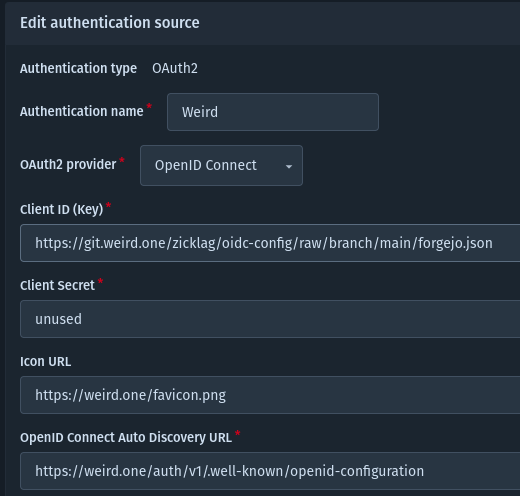

# Adding a "Login with Weird" Button

This doc will explain what it takes to add a "Login to Weird" button to your app.

This is actually very app specific, different apps handle this in different ways, but there are some
general concepts that to help you figure out what's necessary, and we'll describe specifically how
to integrate with [Forgejo](https://forgejo.org/) ( GitTea should be similar ).

This guide is a work-in-progress and may be expanded/improved.

## Generic Overview

Weird runs an [Rauthy](https://github.com/sebadob/rauthy) server, which is an OIDC provider, to
provide authentication support. This means that, in general, to add a "Login with Rauthy" button to
your app, your app must support OIDC login providers.

> **Important:** Weird requires that your app support OIDC PKCE challenges. If you aren't sure, you can
> try to setup your app, and if it works, you're good! If it doesn't work, it will get stuck showing a
> loading symbol on the weird login page, and if you look at the URL on the weird login page, it will
> be missing a `code_challenge` query string parameter. PKCE is not complicated to implement, and you
> should open an issue, if one doesn't already exist, for adding PKCE support to your app if it is
> not supported.

Since there isn't a standardized way to configure OIDC providers, here is an overview of what will
need to be somehow setup in your app.

Your app will need to be made aware of a few different OIDC endpoints. Some apps support "automatic
configuration" through a URL, which, for Weird, is
`https://weird.one/auth/v1/.well-known/openid-configuration`. If a tool does not ask for an auto
config URL, it may instead ask for an "authorization endpoint", a "token endpoint", and a "user info
endpoint", which can be found in the JSON returned by the automatic configuration link.

In addition to the URL configuration, you will need to set a "client ID" and a "client secret". For Weird,
the "client secret" is unused, so you can set it to literally `unused` if you like, as some apps
require it to be set.

The "client ID" must be a URL that points to a JSON file that looks like this:

```json
{
  "client_id": "https://example.com/this/url/must/point/to/this/json/file.json",
  "redirect_uris": ["https://example.com/this/must/be/your/app/OIDC/callback/uri"],
  "grant_types": ["authorization_code", "refresh_token"]
}
```

The `client_id` in the JSON file must be URL to the JSON file. The `reidirect_uris`, will be an array, that
almost always only has one item, and this must be the OIDC callback URL for your app. This is different
for every app, so you will have to check the documentation for your app to figure out what it is.

This JSON file can be hosted wherever you like, as long as it is accessible publicly on the internet, so
that Weird can download it.

### Streamlining Integration

If you are an app developer/contributor and you want to streamline integration with Weird for your users,
you can:

- Use the OIDC auto configuration URL, as the only configuration provided by the user
- Automatically host the client JSON with callback URI for your app.
- Automatically pass the client_id with a URL to that JSON

This way your users literally just have to put in the URL to the Weird instance, and they're done!

## Forgejo

> **Note:** Because Forgejo 7 does not support PKCE, and it was only recently implemented, you need
> to use the experimental Forgejo 8 build for now. See [this Forgejo issue](https://codeberg.org/forgejo/forgejo/issues/2766#issuecomment-1807493).

Here's a specific guide to setting up Weird login on a Forgejo instance.

### Client JSON

The first thing we need to do is host our client JSON. Since we're setting up Forgejo, it's actually
very convenient that we can just create a public Forgejo git repository to put our client JSON in.
You could call this repo something like `oidc-config` or whatever you wish.

Once you've created a new public git repository, create a new file in the repo called something like
`forgejo.json`, and fill it like this:

```json
{
  "client_id": "https://yourforgejo.org/username/oidc-config/raw/branch/main/forgejo.json",
  "redirect_uris": ["https://yourforgejo.org/user/oauth2/Weird/callback"],
  "grant_types": ["authorization_code", "refresh_token"]
}
```

Note that the client_id must be the exact public URL to the JSON file. Also, take note that the in
the redirect URI, the `Weird` name, between `oauth2` and `callback` must match the "Authentication
name" in the next step.

Once you've committed the client JSON file, go to the Forgejo auth administration page
`https://exmapleforgejo.com/admin/auths`, and click "Add authentication source".

Set the following options:

- **Authentication type:** `OAuth2`
- **Authentication name:** `Weird`, or whatever you specified in the callback URL in the JSON
- **OAuth2 provider:** `OpenID Connect`
- **Client ID:** The URL to your client JSON, i.e. `https://yourforgejo.org/username/oidc-config/raw/branch/main/forgejo.json`
- **Client Secret:** `unused`
- **Icon URL:** `https://weird.one/favicon.png`
- **OpenID Connect Auto Discovery URL:** `https://weird.one/auth/v1/.well-known/openid-configuration`



Once you save the configuration, you should be able to log in with Weird!
